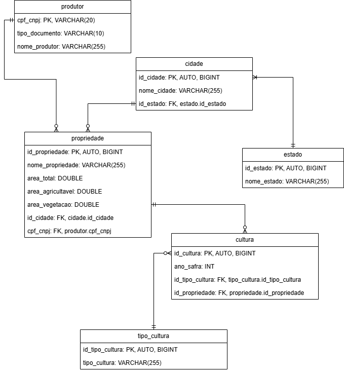

# 🌱 Agric API – Gestão de Produtores Rurais


> API RESTful para cadastro, gestão e análise de produtores rurais, propriedades, culturas e safras. 
Desenvolvida com Django, Docker e PostgreSQL, seguindo as melhores práticas de Clean Code, SOLID, KISS e TDD, com foco em backend para o desafio técnico *Brain Agriculture – Teste Técnico V2*.

---

## ✨ Visão Geral

O Agric API é uma solução robusta para o gerenciamento de produtores rurais, propriedades, culturas plantadas e safras, com validações de negócio, dashboard consolidado e documentação OpenAPI interativa.

---

## 📋 Funcionalidades

- Cadastro, edição e exclusão de produtores rurais (CPF/CNPJ).
- Gestão de propriedades, cidades, estados, tipos de cultura e culturas plantadas por safra.
- Validações automáticas de CPF/CNPJ e áreas das propriedades.
- Dashboard consolidado com estatísticas e agrupamentos.
- API RESTful documentada (Swagger/OpenAPI).
- Testes unitários e de integração (TDD).
- Observabilidade via logs estruturados.
- Pronto para deploy em nuvem (Railway, AWS, etc).

---

## 🏗️ Arquitetura

- **Backend:** Django + Django REST Framework
- **Banco de Dados:** PostgreSQL
- **Containerização:** Docker
- **Testes:** Pytest, DRF Test, cobertura automatizada
- **Documentação:** OpenAPI/Swagger
- **Observabilidade:** Logging estruturado, pronto para integração com ferramentas de monitoramento

---

## 🗂️ Modelagem de Dados



### Principais Tabelas

- **produtor:** CPF/CNPJ, tipo_documento, nome_produtor
- **estado:** id_estado, nome_estado
- **cidade:** id_cidade, nome_cidade, id_estado
- **propriedade:** id_propriedade, nome_propriedade, área total, área agricultável, área vegetação, id_cidade, cpf_cnpj
- **tipo_cultura:** id_tipo_cultura, tipo_cultura
- **cultura:** id_cultura, ano_safra, id_tipo_cultura, id_propriedade

---

## 🚀 Como rodar o projeto

### 1. Clone o repositório

```bash
git clone git@github.com:francisco-ricardo/agric.git
cd agric
```

### 2. Configure variáveis de ambiente

Crie um arquivo .env no diretório raiz, definindo os seguintes valores:

| Variável              | Valor sugerido (exemplo)           | Descrição                                 |
|-----------------------|------------------------------------|-------------------------------------------|
| DJANGO_READ_DOTENV    | 1                                  | Carrega variáveis do .env                 |
| DEBUG                 | 0                                  | 1 para dev, 0 para produção               |
| DJANGO_LOG_LEVEL      | INFO                               | Nível de log (INFO, WARNING, ERROR, etc.) |
| DJANGO_DB_HOST        | agric_api                          | Host do banco usado pelo Django           |
| DJANGO_DB_NAME        | agric                              | Nome do banco usado pelo Django           |
| DJANGO_DB_USER        | agric                              | Usuário do banco usado pelo Django        |
| DJANGO_DB_PASSWORD    | sua_senha_segura                   | Senha do banco usado pelo Django          |
| POSTGRES_HOST         | agric_db                           | Host do banco PostgreSQL                  |
| POSTGRES_PORT         | 5432                               | Porta do banco PostgreSQL                 |
| POSTGRES_DB           | agricdb                            | Nome do banco PostgreSQL                  |
| POSTGRES_USER         | agric                              | Usuário do banco PostgreSQL               |
| POSTGRES_PASSWORD     | sua_senha_segura                   | Senha do banco PostgreSQL                 |
| ALLOWED_HOSTS         | seu.dominio.com,localhost,127.0.0.1| Hosts permitidos (separados por vírgula)  |
| SECRET_KEY            | sua-chave-secreta                  | Chave secreta do Django                   |

### 3. Suba os containers (API e Banco de Dados)

```bash
docker-compose up --build
```

### 4. Crie o banco de dados `agricdb`

```bash
docker exec -it agric_db.dev createdb -U agric agricdb
```

### 5. Faça as migrações

```bash
docker exec -it agric_api.dev sh -c "cd /workspaces/agric/app && python manage.py makemigrations agric"
docker exec -it agric_api.dev sh -c "cd /workspaces/agric/app && python manage.py migrate"
```

### 6. Preencha o banco de dados

```bash
docker exec -it agric_api.dev sh -c "cd /workspaces/agric/app && python manage.py seed"
```

### 7. Suba a aplicação

```bash
docker exec -it agric_api.dev sh -c "cd /workspaces/agric/app && python manage.py runserver 0.0.0.0:8000"
```

Acesse a API em: [http://localhost:8000/api/](http://localhost:8000/api/)

### 8. Acesse a documentação interativa

- **Swagger UI:** [http://localhost:8000/api/docs/](http://localhost:8000/api/docs/)
- **Redoc:** [http://localhost:8000/api/redoc/](http://localhost:8000/api/redoc/)

---

## 📑 Exemplos de Payloads

### Produtor

- **POST /api/produtores/**
```json
{
  "cpf_cnpj": "12345678901",
  "nome_produtor": "João Silva",
  "tipo_documento": "CPF"
}
```

- **GET /api/produtores/12345678901/**
```json
{
  "cpf_cnpj": "12345678901",
  "nome_produtor": "João Silva",
  "tipo_documento": "CPF"
}
```

### Propriedade

- **POST /api/propriedades/**
```json
{
  "nome_propriedade": "Fazenda Boa Vista",
  "area_total": 100.0,
  "area_agricultavel": 80.0,
  "area_vegetacao": 20.0,
  "cidade": 1,
  "produtor": "12345678901"
}
```

### Cultura

- **POST /api/culturas/**
```json
{
  "ano_safra": 2024,
  "tipo_cultura": 1,
  "propriedade": 1
}
```

### Dashboard

Retorna:
- Total de fazendas cadastradas
- Total de hectares registrados
- Gráficos de pizza: por estado, por cultura plantada, por uso do solo

- **GET /api/dashboard/**
```json
{
  "total_fazendas": 3,
  "total_hectares": 250.5,
  "fazendas_por_estado": [
    {"nome_estado": "Minas Gerais", "qtd_fazendas": 2, "total_hectares": 180.0},
    {"nome_estado": "São Paulo", "qtd_fazendas": 1, "total_hectares": 70.5}
  ],
  "culturas_plantadas": [
    {"tipo_cultura": "Grãos", "qtd": 2},
    {"tipo_cultura": "Frutas", "qtd": 1}
  ],
  "uso_do_solo": {
    "total_agricultavel": 200.0,
    "total_vegetacao": 50.5
  }
}
```

---

## 🧪 Testes e Cobertura

- Testes unitários e de integração automatizados com Pytest e DRF Test.
- **Cobertura de testes: 97%**  
  O projeto possui cobertura de testes medida com `pytest --cov`, abrangendo:
  - Todos os fluxos de negócio críticos
  - Validações de regras de negócio e erros esperados
  - Casos de borda e cenários de falha
  - Testes de integração ponta a ponta dos principais endpoints
- Para visualizar o relatório de cobertura em HTML:
  ```bash
  docker-compose exec app pytest --cov --cov-report=html
  # Abra o arquivo htmlcov/index.html no navegador
  ```

---

## 📑 Documentação OpenAPI

Acesse a documentação completa, com exemplos de payloads, descrições e contratos de todos os endpoints em `/api/docs/` (Swagger) ou `/api/redoc/`.

---

## 🛡️ Observabilidade

- Logs estruturados para todas as operações críticas e erros.
- Pronto para integração com Railway, AWS CloudWatch, Sentry, etc.

---

## 💡 Diferenciais Técnicos

- **Clean Code, SOLID, KISS:** Código limpo, modular e fácil de manter.
- **TDD:** Testes desde o início, garantindo qualidade e segurança.
- **OpenAPI:** Contrato de API claro, facilitando integração e manutenção.
- **Pronto para produção:** Docker, logs, variáveis de ambiente, deploy em nuvem.

---

## 🏅 Nível de Maturidade REST

Esta API segue o **Nível 2 do Richardson Maturity Model**:

- Recursos bem definidos e URLs semânticas.
- Uso correto dos verbos HTTP (GET, POST, PUT/PATCH, DELETE).
- Retorno de status HTTP apropriados para cada operação.
- Contratos claros e documentação OpenAPI.
- (Ainda não implementa HATEOAS, que caracteriza o nível 3.)

---

## 🔒 Segurança

O projeto implementa algumas práticas de segurança:

- **Validação rigorosa de dados:** CPF/CNPJ validados, regras de negócio garantidas por serializers e métodos `clean` nos models, validação de áreas das propriedades.

- **Prevenção de injeção de SQL:** Uso exclusivo do ORM do Django.

- **Headers de segurança:** Middlewares padrão do Django (`SecurityMiddleware`, `XFrameOptionsMiddleware`) ativos.

- **Tratamento padronizado de erros:** Respostas HTTP apropriadas, sem exposição de detalhes sensíveis.

- **Logs estruturados:** Todas as operações críticas e erros são registrados para auditoria e monitoramento.

- **Cobertura de testes:** Testes automatizados garantem que regras de negócio e validações de segurança não sejam quebradas.

- **Documentação OpenAPI:** Contrato de API claro, reduzindo riscos de uso incorreto.

**Nota:** Para facilitar o acesso, testes e avaliação técnica, **esta API está aberta e não exige autenticação JWT ou OAuth2**. Isso foi uma decisão consciente, alinhada aos requisitos do desafio e ao objetivo de permitir testes rápidos e integração fácil.
Em ambientes de produção, recomenda-se fortemente:

- Implementar autenticação robusta (JWT, OAuth2 ou similar) para proteger todos os endpoints sensíveis.

- Configurar CORS de forma restritiva, permitindo apenas domínios confiáveis.

- Aplicar rate limiting para evitar abusos e ataques de força bruta.

- Utilizar sempre HTTPS em ambientes públicos.

- Definir permissões e regras de acesso adequadas para cada recurso.

- Nunca expor dados sensíveis em respostas ou logs.

- Manter todos os pacotes e dependências atualizados.

- Monitorar e registrar tentativas de acesso não autorizado e erros críticos.

---

## ⚡ Performance e Escalabilidade

- O projeto utiliza Django e PostgreSQL, tecnologias robustas e amplamente utilizadas em aplicações de missão crítica.
- Para ambientes de produção, recomenda-se:
  - Utilizar servidores WSGI/ASGI performáticos (ex: Gunicorn, Uvicorn) atrás de um proxy reverso (ex: Nginx).
  - Configurar connection pool do banco de dados para suportar múltiplas conexões simultâneas.
  - Ativar cache (Redis/Memcached) para respostas e consultas frequentes.
  - Habilitar compressão de respostas HTTP e uso de CDN para arquivos estáticos.
  - Monitorar métricas de uso, latência e erros com ferramentas como Prometheus, Grafana, Sentry ou APM.
  - Escalar horizontalmente via containers/Docker Swarm/Kubernetes conforme a demanda.
  - Implementar rate limiting para evitar abusos e proteger recursos.
- O código e as queries SQL são otimizados para operações em lote e uso eficiente do ORM.
- Testes de carga e stress são recomendados antes de grandes deploys.

---

## 📦 Deploy em Nuvem

> **Bônus:** O projeto está pronto para deploy em Railway, AWS, Heroku ou qualquer serviço compatível com Docker e PostgreSQL.

---

## ❓ FAQ

**Por que a API não exige autenticação?**  
Para facilitar testes e avaliação, mas está pronta para receber JWT/OAuth2 em produção.

**Como rodar os testes?**  
Veja a seção de testes acima ou execute `docker-compose exec app pytest --cov`.

---

## 📚 Referências

- [Django REST Framework](https://www.django-rest-framework.org/)
- [12 Factor App](https://12factor.net/)
- [Richardson Maturity Model](https://martinfowler.com/articles/richardsonMaturityModel.html)

---

## 👤 Autor

- [Francisco Ricardo Taborda Aguiar](https://github.com/francisco-ricardo)
- Contato: franciscoricardo.dev@gmail.com
- [LinkedIn](https://www.linkedin.com/in/francisco-ricardo-taborda-aguiar-3ab650a0/)

---

## 📝 Licença

Este projeto está licenciado sob a licença MIT.

---